KamiLimu Web-Dev Git 102


## Introduction.
You've recently joined NotACompany LTD as a Web Developer. Your first task is to add your details in the about us section of the website.

To complete the task follow the following 8 steps.
#### Step 1. Create a Fork of the original repository.

> A GitHub fork is a copy of a repository (repo) that sits in your account rather than the account from which you forked the data. Once you have forked a repo, you own your forked copy. This means that you can edit the contents of your forked repository without impacting the parent repo. ~ earthdatascience.org


In our case, the central/original repo is  [https://github.com/muokicaleb/KamiLimu_6.0_git102](https://github.com/muokicaleb/KamiLimu_6.0_git102 ) 
To fork click the fork button on the upper right corner.


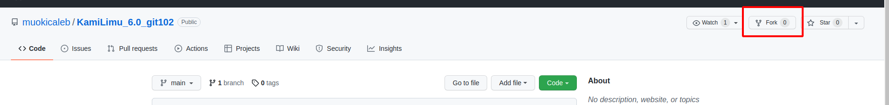

This is how it looks while forking.


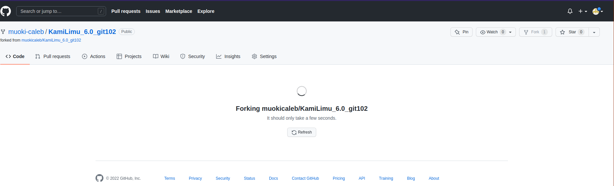

After it completes it will look like this. 


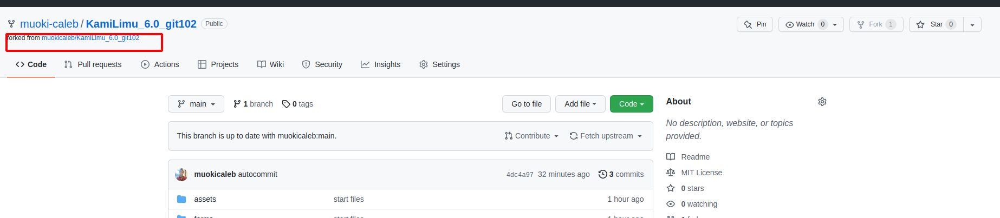

At this point, you have a copy of the project and can continue using our copy.

#### Step 2. Clone the repo.
> When you create a repository on GitHub.com, it exists as a remote repository. You can clone your repository to create a local copy on your computer and sync between the two locations. ~ https://docs.github.com/en/repositories/creating-and-managing-repositories/cloning-a-repository

The repo we forked is on github.com (remote server) to get it to our local machine we need to clone it. 
To clone:
i. Copy the git by clicking the green `code` button.


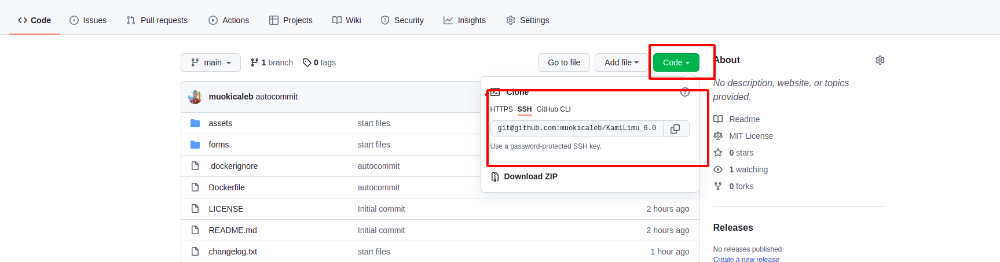

ii. Open a terminal where you want your project repo to be and enter the following command.
```git clone <git repo url>```

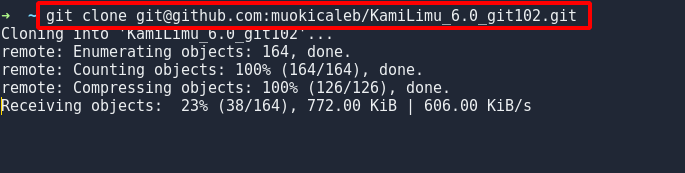
 iii. `cd` into the directory.
 

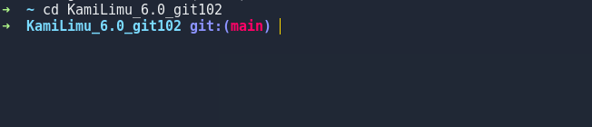
#### Step 3. Create a branch
A git branch is a new/separate version of the main repo. A git branch allows developers to diverge from the main version of the code to fix a bug or add a feature.


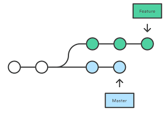

In our situation, we currently have a main branch and need to create another branch to make our changes.
To branch open terminal in the project directory and enter 
```git checkout -b <branch name>	```


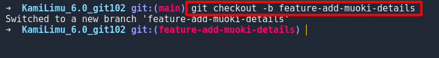
The changes made in the new branch will not affect the main branch.

#### Step 4. Make changes and commit changes.
Open IDE of choice and make changes needed.


- Make changes.

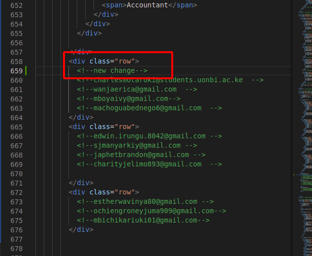\

- Add changes 
```git add ./index.html```


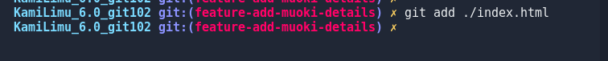


- Commit changes 
```git commit  ```


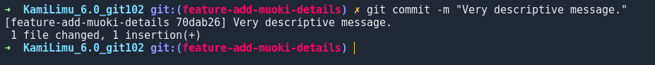

#### Step 5. Push changes
Git push entails moving your code from your local machine to the remote git server (https://github.com)
When pushing it is important to specify the remote server you are pushing to and the branch.
to push
```git push <remote> <branch>```

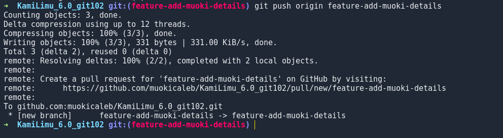

#### Step 6. Create a pull request.
If you go to the project repo you'll find a `compare & pull request` notification.


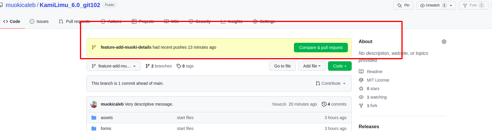

Click the `Compare & pull request` button.


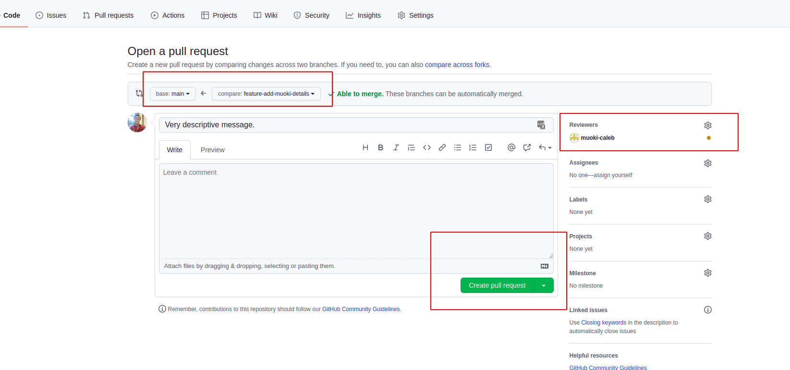
On this page, you can specify where to merge to, the reviewers, and the pull request message.
once satisfied with the changes you can click on `create pull request`.


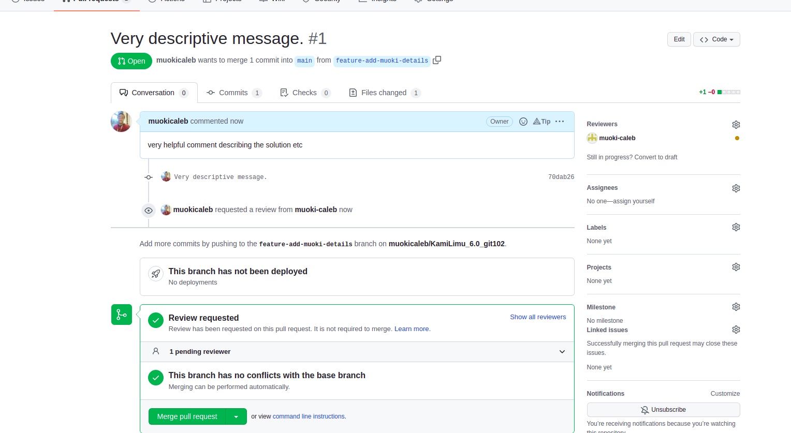

#### Step 7. Review PR
As the owner of the project or a contributor, you can review and approve pull requests.
To review pull requests click on `Pull request` in the navigation tab and select the PR you want to review.


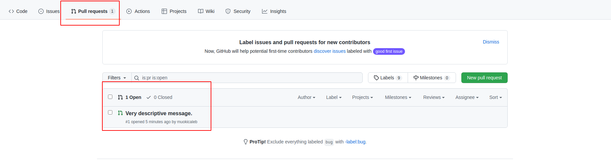


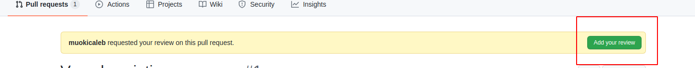
You take a look at the commits & files then either comment, approve or request changes. 


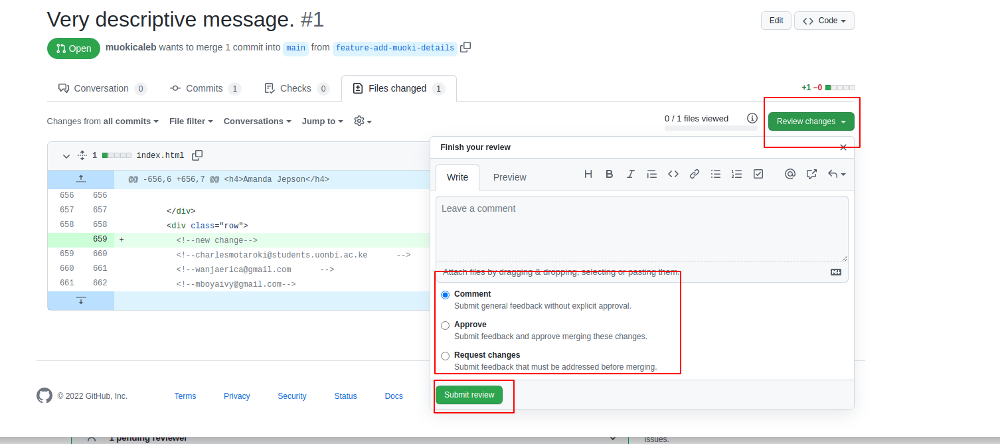

After approving changes.
you'll be able to merge the changes.


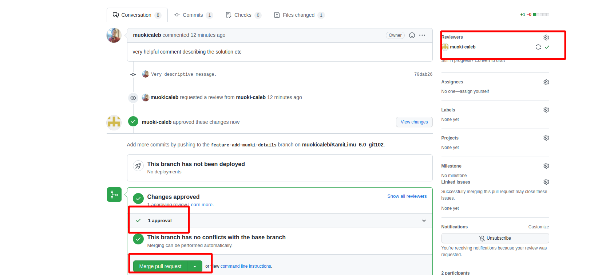


#### Step 8. Merge &/ Rebase
To join the branch we created to the main branch we have three options.


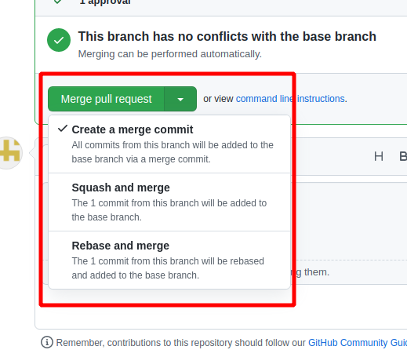


1. `Create a merge commit` - All commits from this branch will be added to the base branch via a merge commit.
2. `Squash and merge` - The 1 commit from this branch will be added to the base branch.
3. `Rebase and merge` - The 1commit from this branch will be rebased and added to the base branch

see - [link](https://rietta.com/blog/github-merge-types/)

**Note:** The difference between merging and rebase is:
- If you are merging main into the feature branch, Merge creates a new "merge commit" in the feature branch that ties together the histories of both branches, giving you a branch that looks like.


- If you are rebasing the feature branch onto the main, the entire feature branch is moved to begin the tip of the main branch, this incorporating all of the new commits in the main. But, instead of using a merge commit, rebasing re-writes the project history by creating brand new commits for each commit in the original branch.


In our case, we will be using `Squash and merge`. 


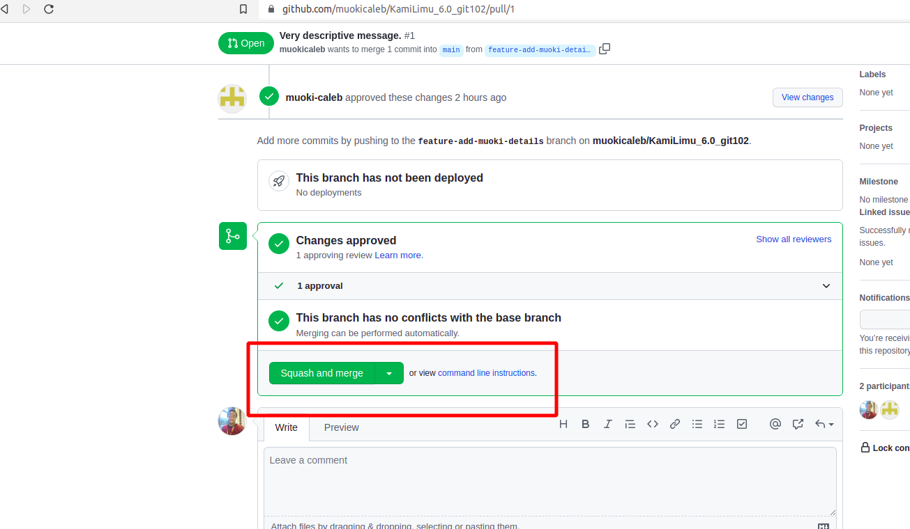


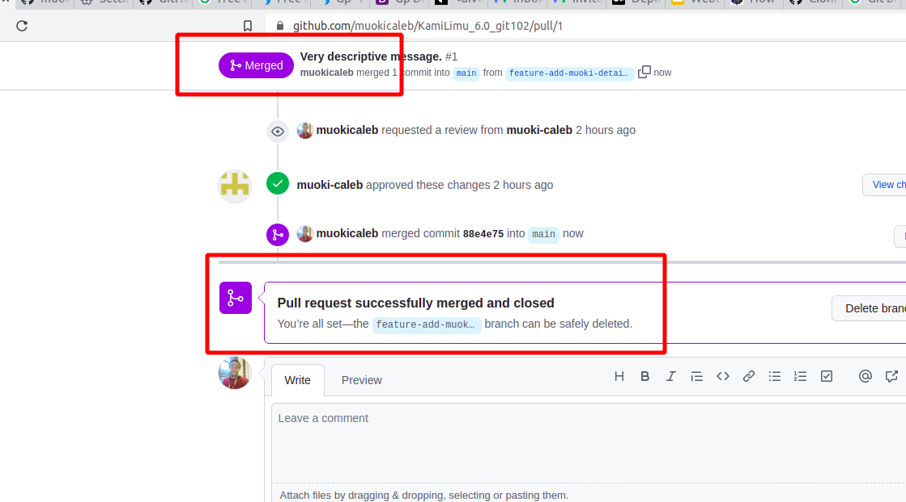


#### Conclusion.
Congratulations you've successfully git forked, branched, made changes to the code base, submitted a PR, reviewed a PR, and merged it to prod. 
Go you!!!!

#### References.
0.  https://github.com/muokicaleb/KamiLimu_6.0_git102 
1. https://www.earthdatascience.org/workshops/intro-version-control-git/about-works/#:~:text=A%20GitHub%20fork%20is%20a,without%20impacting%20the%20parent%20repo.
2. https://docs.github.com/en/repositories/creating-and-managing-repositories/cloning-a-repository
3. https://www.atlassian.com/git/tutorials/merging-vs-rebasing
4. https://rietta.com/blog/github-merge-types/